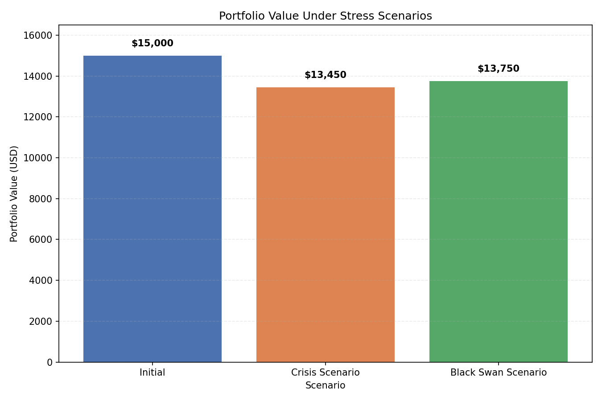

AI-Driven Market & Trading Risk Analytics Dashboard

## Project Overview

AI-Driven Market & Trading Risk Analytics Dashboard implements end-to-end market risk analysis tools including simulated/retrieved market data, Value-at-Risk (VaR) calculations, and stress testing for both systemic and idiosyncratic events.

Key capabilities:
- Simulated or real historical price retrieval (via yfinance, with proxy & fallback to generated data)
- VaR calculation using Historical Simulation and Parametric (variance-covariance) methods
- Stress testing for crisis and black-swan scenarios
- Simple visual reporting (PNG) for stress-test results

## Core Tech Stack

- Python
- yfinance
- pandas
- NumPy
- SciPy
- Matplotlib
- Seaborn

## Repository Files

- `data_fetcher.py` — download prices / generate fallback synthetic prices and compute daily returns
- `risk_analyzer.py` — VaR calculations (historical & parametric)
- `stress_tester.py` — scenario-based stress testing and visualization
- `requirements.txt` — Python dependencies
- `stress_test_report.png` — example output image (created after running `stress_tester.py`)

## Quick Start (Windows PowerShell)

1. Create and activate a virtual environment:

```powershell
cd d:\Code\ai-market-risk-analytics
python -m venv venv
.\venv\Scripts\Activate.ps1
```

2. Install dependencies:

```powershell
pip install -r requirements.txt
```

3. Run the VaR analyzer:

```powershell
python risk_analyzer.py
```

4. Run the stress tester (will produce `stress_test_report.png`):

```powershell
python stress_tester.py
```

The stress test script prints a summary to the terminal and saves a chart named `stress_test_report.png` in the project root.

## Result Preview



## Notes

- If `yfinance` cannot reach remote data sources (network/proxy issues), `data_fetcher.py` falls back to generating realistic-looking synthetic price series so downstream analysis can continue offline.
- You can control proxy settings via the `HTTPS_PROXY` / `https_proxy` environment variable or by modifying the call to `fetch_daily_returns()`.


